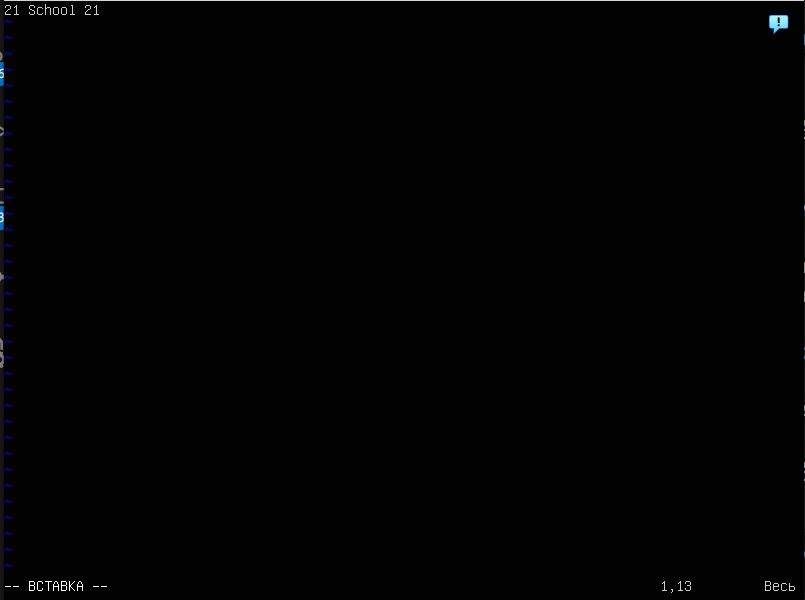
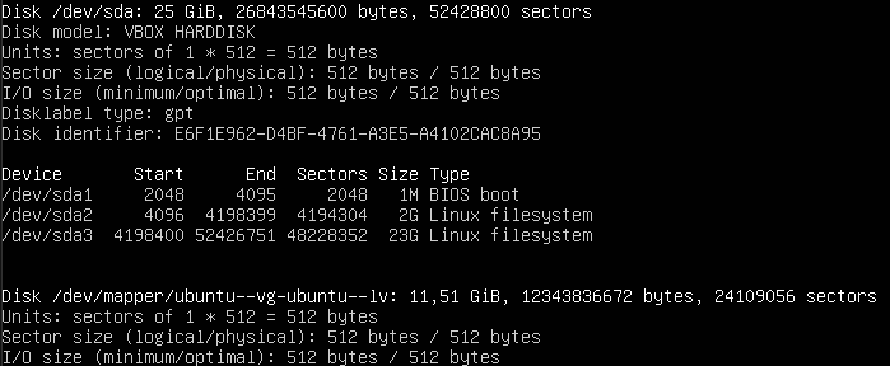

## Part 1. Установка ОС
- Установили **Ubuntu 20.04 Server LTS** *без графического интерфейса*  
- Выполнили команду `cat /etc/issue` 

 

---

## Part 2. Создание пользователя
- Cоздали **новую учётную запись пользователя** с именем *fartvelm2*, выполнив команду `sudo adduser fartvelm2`

- Добавили нового пользователя в группу `adm`, выполнив команду `sudo usermod -a -G adm fartvelm2`

- Проверили основную **информацию обо всех учетных записях пользователей, зарегистрированных в системе**, выполнив команду `cat /etc/passwd`  
- Проверили **принадлежность нового пользователя** группе, выполнив команду `groups fartvelm2`

  

---

## Part 3. Настройка сети ОС
- Задаём **название машины** используя команду `sudo hostnamectl set-hostname user-1`
- Устанавливаем **временную зону** используя команду `sudo timedatectl set-timezone Europe/Moscow`
- Выведем название **сетевых интерфейсов** с помощью команды `ip -br a | awk '{print $1}'`

### Объяснение интерфейсов
***lo:***

Это loopback-интерфейс, который **используется для связи внутри самого устройства**. Он позволяет программам обмениваться данными между собой на локальном уровне, используя IP-адрес 127.0.0.1 (localhost). Это полезно для **тестирования и разработки**.  

***enp0s3:***

Это имя Ethernet-интерфейса, которое сгенерировано в соответствии с новой схемой именования интерфейсов в Linux, известной как "Predictable Network Interface Names".
en указывает на Ethernet-интерфейс, p0 и s3 обозначают, что этот интерфейс находится на первом PCI-слоте и третьем порту.
Этот интерфейс обычно **используется для подключения к сети через проводное соединение**.  

- Используя консольную команду `sudo dhclient -v enp0s3`, получаем информацию **о процессе получения IP-адреса**, от *DHCP-сервера*

### Расшифровка DHCP:
**DHCP** *(Dynamic Host Configuration Protocol)* — протокол, автоматически назначающий IP-адреса, маску подсети, шлюз и DNS-серверы устройствам в сети. Это избавляет от ручной настройки.

- Определяем и выводим **внешний IP-адрес шлюза** (ip), выполняя команду `curl ifconfig.me` и **внутренний IP-адрес шлюза**, он же *ip-адрес по умолчанию* (gw), командой `ip route | grep default | awk '{print $3}'`.

- Задаём **статичные настройки** ip, gw, dns (используем публичный DNS-сервер, 8.8.8.8 от Google), с помощью редактирования файла *конфигурации Netplan* `sudo nano /etc/netplan/00-installer-config.yaml`  
- Применяем **новые настройки** с помощью команды `sudo netplan apply`

  

- Пингуем удалённые хосты _1.1.1.1_ и _ya.ru_  

  

---

## Part 4. Обновление ОС  

- **Обновляем локальные списки пакетов**, получая актуальную информацию о доступных пакетах из репозиториев, с помощью команды `sudo apt upgrade`  

  

---

## Part 5. Использование команды sudo  

_**sudo**_ - В Linux команда `sudo` позволяет обычному пользователю выполнять команды _с правами суперпользователя (root)_ или другого пользователя, **не требуя постоянного входа под root**. Это повышает безопасность, так как минимизирует время работы с максимальными правами и позволяет контролировать, кто и какие команды может запускать. 

- Добавим второго пользователя в группу _с необходимыми правами_, чтобы разрешить пользователю использовать **sudo**. Команда та же, что и с группой `adm`: `sudo usermod -aG sudo fartvelm2`  

- Перезапустим сессию, с помощью команды `sudo reboot`  

- Проверим успешность выданных прав `sudo whoami`

  

- Изменяем имя хоста с помощью уже знакомой команды `sudo hostnamectl set-hostname user-2`  

- Проверим имя хоста используя команду `hostname`  

  

---  

## Part 6. Установка и настройка службы времени  

- Выведем время часового пояса, в котором я сейчас нахожусь, выполним команду `timedatectl | grep "Time zone"`  

- Проверим статус синхронизации, командой `timedatectl show | grep NTPSynchronized`  

  

---

## Part 7. Установка и использование текстовых редакторов  

- Установим **текстовые редакторы** VIM, NANO и JOE, выполнив команду `sudo apt install vim nano joe`

### VIM  
#### редактирование с сохранением:

- После создания текстового файла с помощью команды `touch test_vim.txt`, откроем файл командой `vim test_vim.txt`. Для заполнения файла, _необходимо войти в режим "вставки"_, клавишей `i`.  

  

- Для успешного __сохранения содержимого и выхода__ из редактора выходим из режима _"вставки"_ в режим _"команд"_ клавишей `Esc`. Вводим соответствующую команду `:wq`, что буквально означает _"write and quit"_. 

#### редактирование без сохранения:

- Заменяем существуюущий текст **на новый**.

- Выходим в режим команд, __выходим без сохранения__ с помощью команды `:q!`

#### поиск и замена паттернов  

- Произведем **поиск в текстовом файле**, внутри редактора. Для этого необходимо выйти _в режим команд_, и символом `/` перейдём _в режим поиска_, введём искомое слово и клавишей `Enter` отправим запрос. **Для перемещения** между вхождениями используем `n`- для _следующего_ и `N`- для _предидущего_ вхождения.  

- Заменим мой ник на обратную последовательность букв, с помощью команды `:s`. Выполним замену по всему файлу используя _[range]_, перед командой замены необходимо указать строки (1,10 - с 1 по 10 строку) или символом `%` **выбрать весь файл** для действия.   

- Выполняем команду `:%s/fartvelm/mlevtraf/gс`, где `g` - флаг означающий замену не только первого вхождения в строке, но и **всех последующих**. Добавляя флаг `c` мы можем останавливаться на каждой замене, **проверяя и разрешая действие**. Ответом на разрешения используют *y-yes*, *n-no*, *a-all*(отмена флага с), *q-quit*(выход из процесса замены).

  

### NANO
#### редактирование с сохранением:

- После создания текстового файла с помощью команды `touch test_nano.txt`, откроем файл командой `nano test_nano.txt`  

  

- Для успешного __сохранения содержимого и выхода__ из редактора выходим сочетанием клавиш `Ctrl + O`, _"write out"_. Подтверждаем имя файла клавишей `Enter`, и сочетанием `Ctrl + X` выходим из редактора. 

#### редактирование без сохранения:

- Заменяем существуюущий текст **на новый**.

- __Выходим без сохранения__ с помощью сочетания клавиш `Ctrl + X`, если внесенные изменения нам не понадобяться - клавишей `N` отказываемся от сохранения.

#### поиск и замена паттернов  

- Произведем **поиск в текстовом файле**, внутри редактора. Для этого перейдём _в режим поиска_ сочетанием клавиш `Ctrl + W`, введём искомое слово и клавишей `Enter` отправим запрос.

- Заменим мой ник на обратную последовательность букв, с помощью сочетания клавиш `Ctrl + \`. После команды замены необходимо напечатать текст __который нужно заменить__, после чего подтверждаем клавишей `Enter`, затем вводим текст __на который нужно заменить__, и так же подтверждаем.

- _Nano_ предлагает ___подтвердить замену для каждого вхождения___. Клавишей `Y` подтверждаем замену или клавишей `N` пропускаем. Клавиша `A` заменит оставшиеся вхождения _без подтверждений_.

  

- Так же есть возможность _настроить Nano_, изменив файл конфигурации `~/.nanorc`, где можно указать различные параметры, такие как _включение подсветки синтаксиса_ или _отображение номеров строк_.

### MCEDIT
#### редактирование с сохранением:

- После создания текстового файла с помощью команды `touch test_mcedit.txt`, откроем файл командой `mcedit test_mcedit.txt`  

  

- Для успешного __сохранения содержимого и выхода__ из редактора сохраняем клавишей `F2` и подтверждаем сохранение, затем выходим клавишей `F10`.  

#### редактирование без сохранения:

- Заменяем существуюущий текст **на новый**.

- __Выходим без сохранения__ с помощью клавиши `F10`, если внесенные изменения нам не понадобяться отказываемся от сохранения.

#### поиск и замена паттернов  

- Произведем **поиск в текстовом файле**, внутри редактора. Для этого перейдём _в режим поиска_ клавишей `F7`, введём искомое слово и клавишей `Enter` отправим запрос.  

- Есть возможность уточнить запрос с помощью дополнительных команд: игнорировать регистр; все совпадения; регулярные выражения и т.п.

- Заменим мой ник на обратную последовательность букв, с помощью сочетания клавиш `Ctrl + K`, и последующей за ними `A`. После необходимо напечатать текст __который нужно заменить__, после чего подтверждаем клавишей `Enter`, затем вводим текст __на который нужно заменить__, и так же подтверждаем.

- _MCEDIT_ предлагает ___подтвердить каждую замену для каждого вхождения___. Подтверждаем замену или пропускаем. 

 

---

## Part 8. Установка и базовая настройка сервиса SSHD  
**SSHD** (**S**ecret **SH**ell **D**aemon) - это демон _(служба)_ SSH-сервера, который принимает и обрабатывает входящие SSH-подключения от клиентов. Он обеспечивает ___безопасный удалённый доступ к системе___, позволяя выполнять команды, передавать файлы и администрировать сервер по зашифрованному каналу.

- Установим службу SSH с помощью команды `sudo apt install openssh-server`.  

- Добавим _автостарт службы при загрузке системы_, используя команду `sudo systemctl enable ssh`  

- Перенастроим службу SSHd на порт 2022, обычно это делается для _соблюдения политик безопасности_ или _управления трафиком_. **Необходимо отредактировать конфигурационный файл SSHD** c помощью команды `sudo nano /etc/ssh/sshd_config`.

- Заменим порт, в строке "#Port 22" на "Port 2022". **Сохраняем и выходим** из текстового редактора. 

- После внесения изменений **необходимо перезапустить службу SSH**, чтобы они вступили в силу. Выполняем `sudo systemctl restart ssh`

- Убедимся, что служба запущена. Используя команду `ps` *"process status"*, **посмотрим наличие процесса sshd**. Для этого к команде необходимо ***подобрать ключи***. Команда `ps aux | grep [s]shd`, в которой:   
    - ключ `a` - показывает процессы *всех* пользователей, а не только текущего;  
    - ключ `u` - отображает *информацию о владельце* процесса, а также время его запуска и использование ресурсов (CPU, память);  
    - ключ `x` -  показывает процессы, *которые не имеют управляющего терминала*. Это полезно для отображения фоновых процессов, таких как ***"sshd"***.

- Квадратные скобки "[s]" вместо обычного "s" **позволяют исключить сам процесс grep из результатов**. Это значит, что если вы просто использовали *grep sshd*, то процесс *grep* тоже появился бы в списке, так как он ищет строки, содержащие *sshd*. Использование [s] делает так, что **при поиске не совпадает с самим процессом grep**.  

- Убедимся, что служба SSH **прослушивает определённый порт** *(заданный ранее)*, это подтверждает, что она работает и готова принимать соединения. Устанавливаем утилиту `netstat`, с помощью команды `sudo apt install net-tools`. 

- Командой `netstat -tan | grep 2022` **проверяем прослушиваемый порт**, где:  
    - `-t` - показывает *только TCP-соединения*. Это важно, так как SSH использует протокол TCP;  
    - `-a` - показывает *все соединения и слушающие порты*. Это позволяет увидеть как активные соединения, так и те, которые находятся в состоянии ожидания;  
    - `-n` - показывает *IP-адреса и порты в числовом виде, без попытки разрешения имён*. Это ускоряет вывод и **позволяет избежать возможных задержек**, связанных с DNS-запросами.

- **Расшифруем** каждый столбец выведенной команды: 

    1. tcp: ***Протокол***, который используется ***для соединения***. В данном случае это TCP.

    2. 0 0: Эти два числа представляют собой ***количество байт в очереди на отправку и приём***. В данном случае это означает, что нет данных, ожидающих отправки или получения.

    3. 0.0.0.0:2022: ***Локальный адрес и порт***. 0.0.0.0 означает, что служба прослушивает на всех интерфейсах сервера, будь то локальная сеть или интернет, а 2022 — это номер порта, на котором работает служба.

    4. 0.0.0.0:\*: ***Удалённый адрес и порт***. Звёздочка (*) указывает на то, что служба принимает соединения от любых удалённых адресов.

    5. LISTEN: ***Состояние сокета***. Это означает, что сокет находится в режиме ожидания и готов принимать входящие соединения.  

---

## Part 9. Установка и использование утилит top, htop  
### top
- Утилита `top` - это стандартная часть большинства дистрибутивов Linux и обычно _предустановлена по умолчанию_, проверим её наличие командой `which top`. Выводится **путь** - значит утилита установлена 

- Запускаем утилиту введя `sudo top` в терминал

  

- Соберём **некоторые данные** с помощью этой утилиты:  
    1. Uptime (_время работы системы_) -  `43 min`  

      Позволяет понять, как долго сервер или компьютер работает без перезагрузки - полезно для диагностики стабильности.  

    2. User (_количество авторизованных пользователей_) - `1` 
      
      Помогает понять, сколько людей активно работают на сервере, что может влиять на нагрузку.

    3. Load average (_cредняя загрузка системы_) - `0.00, 0.00, 0.00`

      Эти числа показывают среднее количество процессов, ожидающих или использующих CPU за последние 1, 5 и 15 минут.
      
      Если число равно количеству ядер CPU - система загружена на 100%.
      
      Если выше - процессы ждут своей очереди.
      
      Если ниже - система работает с запасом.
      
    4. Tasks (_общее количество процессов_) - `95 total, 1 running, 94 sleeping, 0 stopped, 0 zombie`
  

      Здесь:
      
      total - всего процессов,
      
      running - активно выполняющихся,
      
      sleeping - ожидающих,
      
      stopped - остановленных,
      
      zombie - "зомби" (процессы, завершившиеся, но ещё не убранные).

    5. %Cpu(s) (_загрузка CPU/распределение времени_) - `0.3 us,  0.0 sy,  0.0 ni, 99.7 id,  0.0 wa,  0.0 hi,  0.0 si,  0.0 st`  
      
      Значения:
      
      us(user space) - Время, потраченное на пользовательские процессы 
      
      sy(kernel space) - Время, потраченное на системные процессы 
      
      ni(nice) - Время на процессы с изменённым приоритетом 
      
      id(idle) - Время простоя CPU 
      
      wa(I/O wait) - Время ожидания ввода-вывода 
      
      hi(hardware interrupts) - Время обработки аппаратных прерываний 
      
      si(software interrupts) - Время обработки программных прерываний 
      
      st(steal time) - Время "украденное" виртуальной машиной  
    
    6. MiB Mem/MiB Swap (_загрузка оперативной/виртуальной памяти_) -   
    `MiB Mem :  1971.6 total,  1434.1 free,  142.9 used,  394.6 buff/cache`  
    `MiB Swap:  2048.0 total,  2048.0 free,     0.0 used.  1675.6 avail Mem`  
      
      Значения:
      
      total - общий объём памяти,
      
      free - свободная память,
      
      used - используемая память,
      
      buff/cache - память, занятая буферами и кэшем,
      
      avail Mem - доступная для приложений память.  

    7. %MEM (_PID процесса, занимающего больше всего памяти_) - `1`  

    8. %CPU (_PID процесса, занимающего больше всего процессорного времени_) - `1127`  

### htop

- Запускаем утилиту `htop` - интерактивный монитор с графиками загрузки по ядрам и списком процессов

  

- Производим сортировку клавишей `F6`, по **PID** (_идентификатор процесса, уникальный номер_)

- Производим сортировку по **PERCENT_CPU** (_процент использования CPU процессом_)

- Производим сортировку по **PERCENT_MEM** (_процент использования оперативной памяти процессом_)

- Производим сортировку по **TIME** (_общее процессорное время, затраченное процессом с момента запуска_)

  

- Производим фильтрацию клавишей `F4` для **sshd** (____htop___ отобразит только процессы, в имени или аргументах которых встречается sshd_)

- Производим поиск клавишей `F3` для **syslog** (____htop___ выделит первое вхождение процесса с таким именем_), повторным нажатием клавиши перемещаемся по вхождениям

- Выведем дополнительную информацию:
    - имя машины (hostname), 
    - текущее время (clock) 
    - и время работы системы (uptime) в самой панели мониторинга

, с помощью настройки заголовка "header". 

- Для этого перейдем в настройки клавишей `F2`, перейдем в раздел `Meters` (_счётчики_), использя стрелки выбираем из списка доступных - необходимые. Клавишей `F10` сохраняем изменения и выходим.

  

---

## Part 10. Использование утилиты fdisk

- Выполним команду `sudo fdisk -l`, это утилита для __управления разделами жёсткого диска__. Она позволяет _создавать, удалять и изменять_ размеры разделов, а также _просматривать информацию_ о дисках и их разделах. Флаг `-l` (_list_) используется для вывода списка _всех доступных дисков и их разделов_.

- Определим необходимую информацию о жёстком диске. Информацию о `swap` мы __не найдем__ в этой команде, потому что в нашем случае __используется не раздел, а "swap-файл"__.

  

- Выполним команду `sudo free -h` - эта утилита для отображения информации о памяти в системе, _включая использование оперативной памяти и swap_. Флаг `-h` означает _human-readable_ (__читаемый для человека__). Он _преобразует значения в более удобные единицы_, такие как килобайты (K), мегабайты (M) и гигабайты (G), вместо того чтобы отображать их в байтах

    
    Название жёсткого диска - "/dev/sda"

    Размер жёсткого диска - 25Гб

    Колличество секторов - 52428800шт

    Размер swap - 2Гб  

---

## Part 11. Использование утилиты df

- Выполним команду `sudo df` (_disk free_) - это базовый и очень важный инструмент в Linux для получения __информации о дисковом пространстве__, занятом и доступном на файловых системах. Она _помогает понять, сколько места занято, сколько свободно_, и какой процент использования каждого раздела. 

- Определим необходимую информацию __для корневого раздела__ (_точка монтирования - "/"_ )  
    
        1K-blocks (_размер раздела_) - 11758760Кб
        
        Used (_размер занятого пространства_) - 4931044Кб
        
        Available (_размер свободного пространства_) - 6208608Кб
        
        Use% (_процент использования_) - 45%
        
        Единица измерения - Килобайты

- Определим необходимую информацию __с использованием флагов__ `-T`(_показать типы файловых систем_)  и `-h` (_читаемый формат_)  
           
        Size (_размер раздела_) - 12G

        Used (_размер занятого пространства_) - 4.8G

        Avail (_размер свободного пространства_) - 6G

        Use% (_процент использования_) - 45%

        Type (_тип файловой системы_) - ext4 (Extended File System)    

---

## Part 12. Использование утилиты du

- Выполним команду `sudo du` (_disk usage_) - это мощный инструмент __для оценки занимаемого дискового пространства файлами и папками__. В отличие от df, который показывает свободное и занятое место на разделе, _du анализирует именно использование места_ конкретными файлами и каталогами. Если не указывать путь, результат будет актуален _для текущего каталога_.  

- Выведем __информацию о размере определенных папок__, с помощью команды `sudo du -s -b`, где `-s`(_summarize_)  - показывает _только общий размер_ указанной директории, без деталей по подкаталогам, а `--bytes` выводит ___размер в байтах___

  

- Выведем информацию о размерах ___в человекочитаемом виде___ с помощью флага `-h`

- Выведем размер всего содержимого (_каждого элемента_) в `/var/log` командой `sudo du -sh /var/log/*`

  

---

## Part 13. Установка и использование утилиты ncdu

- Установим команду `sudo apt install ncdu`, (__NC__urses __D__isk __U__sage) - это удобный консольный __анализатор использования дискового пространства__. Он работает поверх команды du, но предоставляет _интерактивный интерфейс_ с возможностью навигации по каталогам, сортировки, фильтрации и удаления файлов. Позволяет _быстро и наглядно определить_, какие папки и файлы занимают больше всего места. Особенно _полезен на серверах и VPS_, где нет графического интерфейса.

- Выведем интерактивную информацию о размерах каталогов и их содержимых с помощью команды `ncdu /[имя каталога]`

  
    
        Количество символов # визуально показывает объем занимаемого места.

        q - Выход из программы
        
        d - Удалить выбранный файл или папку
        
        n - Сортировка по имени
        
        s - Сортировка по размеру
        
        t - Сначала показывать папки, затем файлы
        
        g - Режим отображения (проценты, графика)
        
        a - Показать размер файла или занятие места
        
        e - Показать/скрыть скрытые файлы
        
        i - Показать информацию о выбранном элементе
        
        r - Пересчитать размеры
        
        ? - Помощь  

---

## Part 14. Работа с системными журналами

___Системные журналы___ представляют собой __файлы или базы данных__, в которые записываются _события, происходящие в системе_. Системные журналы могут иметь различную структуру, но обычно они содержат следующие элементы:
        
        Временная метка: Указывает время и дату события.
        
        Уровень важности: Указывает серьезность события (например, INFO, WARNING, ERROR, CRITICAL).
        
        Сообщение: Описание события, которое произошло.
        
        Идентификатор процесса: Указывает, какой процесс или служба вызвали событие.
        
        Имя хоста: Имя машины, на которой произошло событие (в случае распределенных систем).

Системные журналы ___используются для___:

1. __Диагностики проблем__: Логи помогают _выявить причины сбоев_, ошибок и других проблем в системе.
    
2. __Мониторинга производительности__: Анализ журналов может помочь выявить узкие места и _оптимизировать производительность_.
    
3. __Аудита и безопасности__: Журналы могут содержать информацию о попытках доступа, изменениях в системе и других действиях, _которые могут угрожать безопасности_.
    
4. __Отладки__: Разработчики могут использовать логи для отслеживания поведения приложений и _выявления ошибок в коде_.

- Откроем __для просмотра__ необходимые логи (_в большинстве дистрибутивов Linux журналы хранятся в каталоге `/var/log`_), при помощи утилиты `sudo less /[имя каталога]` - позволяет пользователям _просматривать большие файлы постранично_, а также перемещаться по содержимому файла

Файл `/var/log/dmesg`(_diagnostic message_) содержит __сообщения ядра__, которые выводятся при загрузке системы и во время работы. Эти сообщения включают _информацию об обнаруженных устройствах, драйверах, ошибках_ и других событиях, связанных с ядром и аппаратным обеспечением.

Файл `/var/log/syslog`(_system log_) содержит __общие системные сообщения__, включая информацию о работе различных системных служб и приложений. Этот лог часто _используется для записи информационных, предупреждающих и ошибок сообщений_ от различных компонентов системы.

Файл `/var/log/auth.log`(_authentication_) содержит __записи, связанные с аутентификацией и авторизацией пользователей__. Это включает _входы в систему, попытки входа, изменения прав доступа_ и другие события, касающиеся безопасности.

- __Найдем__ в логе _аутентификации_ время последней успешной авторизации, имя пользователя и метод входа в систему. Строка `session opened` - указывает на то, что сессия пользователя была _успешно открыта_ после успешной аутентификации.

        
        Время - 19:50:18

        Имя - fartvelm2

        Метод - локальный вход через команду `login`, а аутентификация выполняется с использованием модуля `pam_unix` (проверяет учетные данные пользователей с использованием стандартных UNIX-методов).

- __Перезапустим службу__ SSHd с помощью команды `sudo systemctl restart ssh` и _проверим статус_ службы командой `sudo systemctl status ssh`

- Найдем сообщение о рестарте службы "SSHd" в логах

  

---

## Part 15. Использование планировщика заданий CRON

- Используя планировщик заданий, __запустим команду `uptime`__ через каждые 2 минуты, с помощью редактора `crontab`, _для редактирования_ выполним команду с флагом `-e`, откроется текстовый редактор - файл с текущими cron-записями (_если их нет - пустой_)

- Добавляем строку вида `*/2 * * * * /usr/bin/uptime >> /tmp/uptime.log 2>&1`

 

       Где: 
    
      */2 - Каждые 2 минуты	(Минуты [0-59])

      * - Каждый час	(Часы [0-23])  

      * - Каждый день месяца	(День месяца [1-31])  

      * - Каждый месяц	(Месяц [1-12])  

      * - Каждый день недели	(День недели [0-7, где 0 и 7 - воскресенье])

      /usr/bin/uptime - полный путь к команде uptime (узнать можно через "which uptime")

      >> /tmp/uptime.log 2>&1 - перенаправляет стандартный вывод и ошибки в файл /tmp/uptime.log, добавляя в конец. 1 — это стандартный вывод (stdout). 2 — это стандартный вывод ошибок (stderr). 2>&1 означает, что стандартный вывод ошибок будет перенаправлен в стандартный вывод. Это значит, что как обычный вывод, так и ошибки будут записываться в один и тот же файл (/tmp/uptime.log).

- __Найдём__ в логе системы 2 _строчки о выполнении_ команды `cron`

- Выведем на экран __список текущих заданий__ для CRON данного пользователя с помощью команды `crontab -l`. Для других пользователей - `sudo crontab -u [username] -l`, где ключ `-u`  позволяет указать другого пользователя, чьи задания cron вы хотите редактировать, просмотреть или удалить(_всегда с правами суперпользователя_).

- __Удалим все текущие задачи__ для данного пользователя, используя команду `crontab -r`, где ключ `-r` используется для удаления всех заданий без подтверждения

  
---